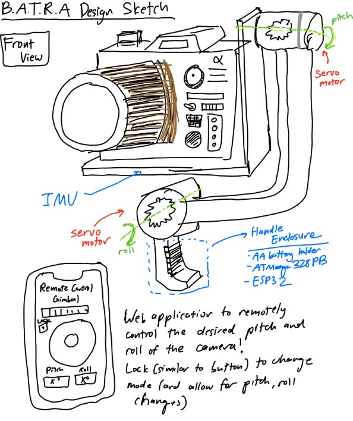
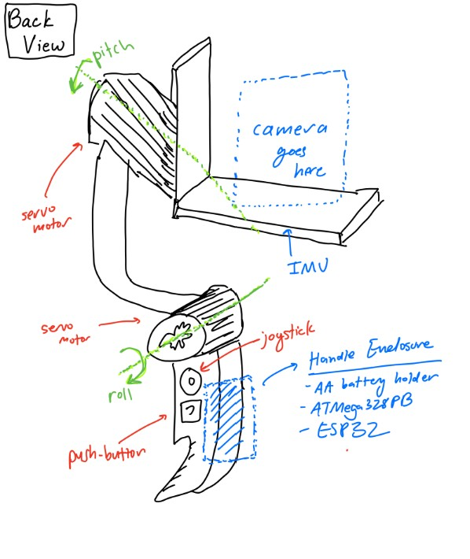
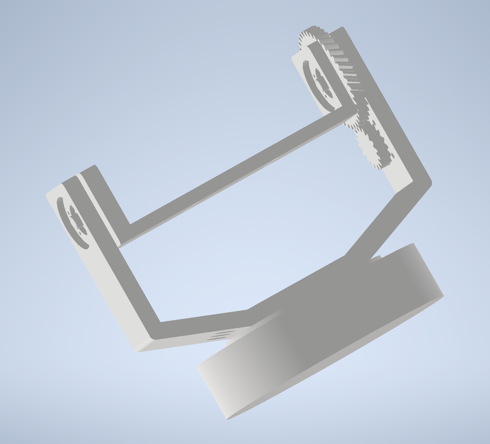
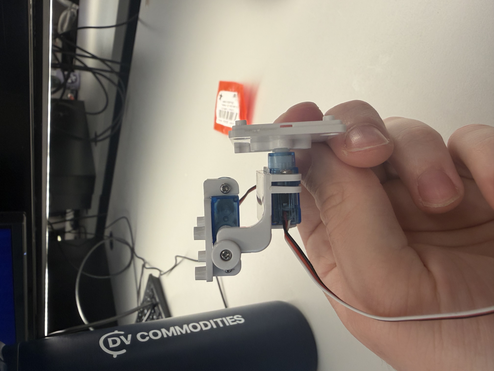
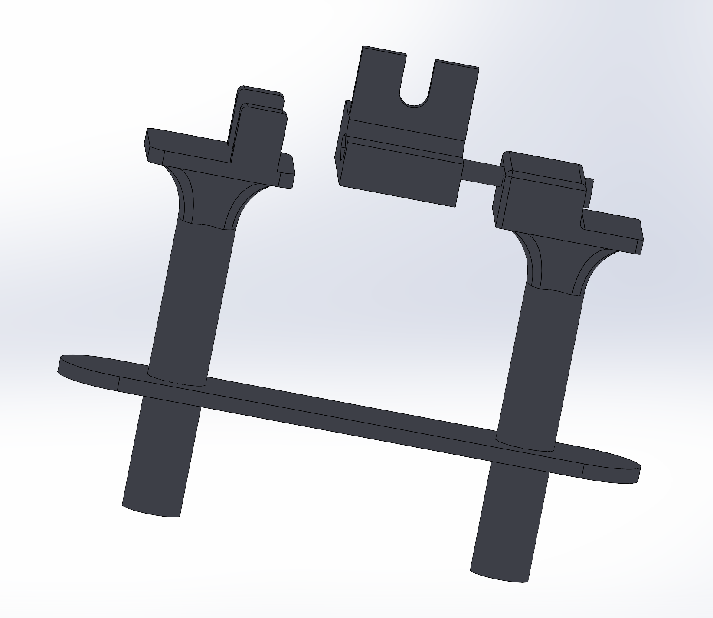
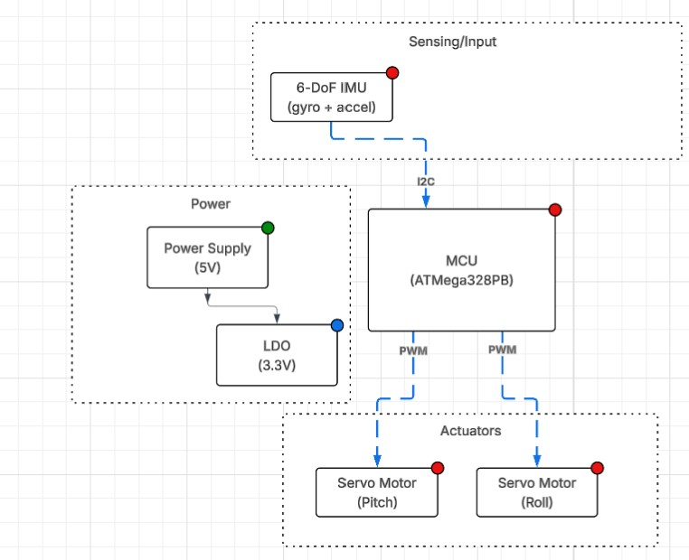
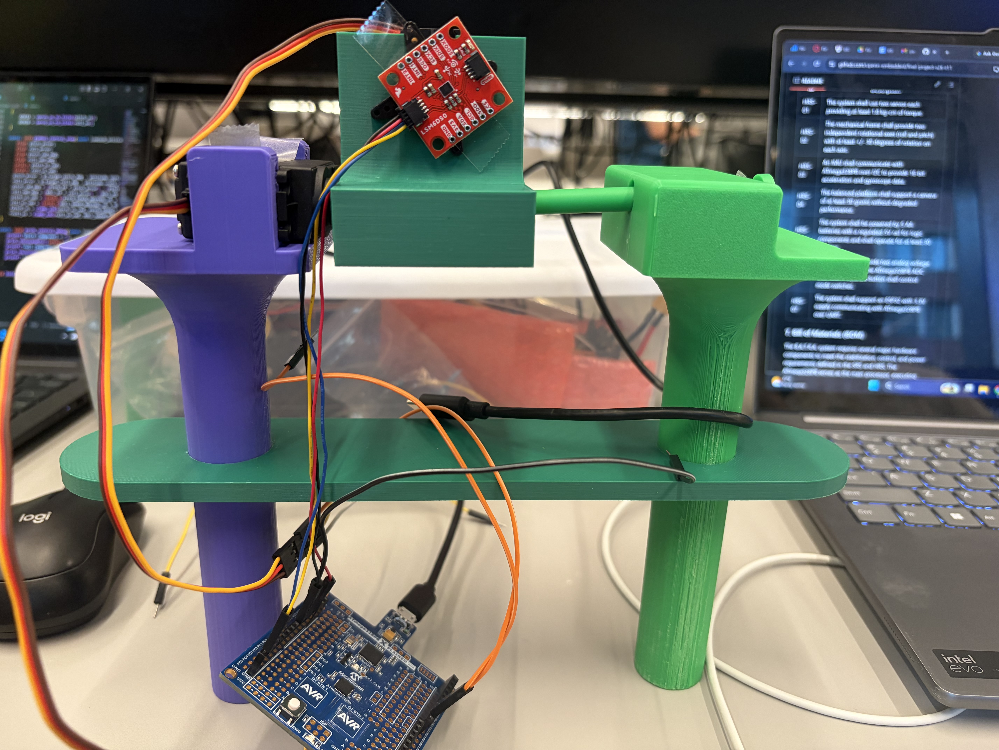
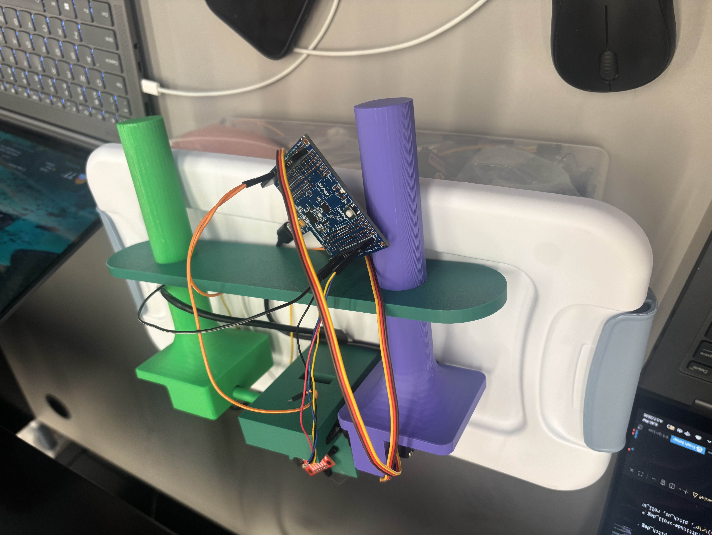
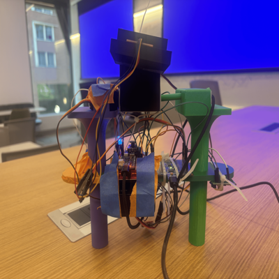

[Review Assignment Due Date](https://classroom.github.com/a/-Acvnhrq)

# Final Project

**Team Number: 11**

**Team Name: B.A.T.R.A. (Balanced Automated Two-axis Rotational Assembly)**

| Team Member Name | Email Address                                          |
| ---------------- | ------------------------------------------------------ |
| Eugene Veksler   | [eugvek@seas.upenn.edu](mailto:eugvek@seas.upenn.edu)     |
| Maxim Veksler    | [mveksler@seas.upenn.edu](mailto:mveksler@seas.upenn.edu) |
| Ishan Mungikar   | [mungikar@seas.upenn.edu](mailto:mungikar@seas.upenn.edu) |

**GitHub Repository URL: [https://github.com/upenn-embedded/final-project-s26-t11](https://github.com/upenn-embedded/final-project-s26-t11)**

**GitHub Pages Website URL:** [https://upenn-embedded.github.io/final-project-s26-t11/](https://upenn-embedded.github.io/final-project-s26-t11/)**

Hey Graders! The Final Project Reflection and Submission is at the bottom of this document.

## Final Project Proposal

### 1. Abstract

B.A.T.R.A. is an automated two-axis IMU-stabilized camera gimbal with joystick control. An inertial measurement unit continuously determines the camera's orientation and a PID control algorithm drives two servo motors to keep the camera stable. An analog joystick is used by the operator to set the horizontal and vertical viewing angle. Bare metal C firmware on an ATmega328PB is used to maintain the set angle. Additionally, an ESP32 Wi-Fi module is utilized to wireless control the horizontal and vertical viewing angle.

### 2. Motivation

Any time you watch a smooth aerial drone shot, use a handheld camera without a nauseating shake, or watch a robot navigate a warehouse, there is some kind of video stabilization system working behind the scences. Video stabilization was always essential for high quality videos or movies, but now it has become crucial for computer vision applications where stable video makes consistent object detection possible.

Although video gimbals aren't a niche topic, the process of desiging a gimbal is very application specific and tackles the core challenge of decreasing the noise in input data. By also instituting remote control with our project, we allow this mechanism to be potentially extended in applications involving autonomous vehicles and drones.

### 3. System Block Diagram

### 4. Design Sketches

### 5. Software Requirements Specification (SRS)

The software for B.A.T.R.A. is responsible for reading sensor data, running the stabilization control loop, processing user input on the joy stick, and driving the servo motor output. All of this is meant to be done in real time on an ATmega328PB running bare metal C. We also have an ESP32 Wi-Fi module which allows for wireless communication with a device running a web application to remotely control the orientation of the camera.

**5.1 Definitions, Abbreviations**

* IMU - Intertial Measurement Unit (Provides acceleration and gyroscope data)
* PID - Proportional-Integral-Derivative control algorithm
* PWM - Pulse Width Modulation (Signal format used for controlling servo motor position)
* ADC - Analog to Digital Converter (Reads analog voltage values and converts into digital format)
* I2C -  Inter-Integrated Circuit Communication Protocol (Serial bus communication used to communicate with IMU)
* Dead Region - Position range around joystick center that is read as a center input to reduce noise due to misalignment in joy stick construction

**5.2 Functionality**

| ID     | Description                                                                                                                                                                                                                                                                                                                                       |
| ------ | ------------------------------------------------------------------------------------------------------------------------------------------------------------------------------------------------------------------------------------------------------------------------------------------------------------------------------------------------- |
| SRS-01 | The firmware shall read 3-axis acceleration data and 3-axis gyroscope data from the IMU over I2C at a rate of 100 Hz +/- 10 Hz.                                                                                                                                                                                                                   |
| SRS-02 | The firmware shall sample the 2 ADC channels recording data from the 2 axes of the joystick at a rate of at least 50 Hz and have a dead region at +/- 5% of the sensor range around the joystick sensor to prevent "stick drift".                                                                                                                 |
| SRS-03 | The firmware shall complete a PID control loop for each axis at least every 10 ms +/- 2 ms. This loop involves computing the corrective commands send to the servo motors from the error between measured and desired angle.                                                                                                                      |
| SRS-04 | The firmware shall generate the PWM signals for the two servo motors with PWM ranges from 1 ms to 2 ms, corresponding to the angular range of the servo motors.                                                                                                                                                                                   |
| SRS-05 | The firmware shall support two operating modes. One mode is a stabilized hold where the current pitch and roll angles are maintained, and the other mode is where a joystick is used sets the desired stabilization angle (and thus the camera position can be controlled from the joystick). The modes can be selected using a mode button. |
| SRS-06 | When the mode select button is held for at least 1 second, the firmware shall level out the platform within 2 seconds.                                                                                                                                                                                                                            |
| SRS-07 | The stabilization firmware shall reject any disturbances of +/- 15 degrees in the roll or pitch and return the platform to +/- 3 degrees of the requested roll/pitch within 500 ms.                                                                                                                                                               |
| SRS-08 | The firmware shall accept wireless commands for pitch, roll, and mode received from ESP32 over UART and update the desired angle settings within 100ms of receiving update.                                                                                                                                                                       |

### 6. Hardware Requirements Specification (HRS)

The hardware forms the physical construction and control of B.A.T.R.A. The sensors, frame, power system, switches, motors, bearings, and user-interface components provide functionality to the software.

**6.1 Definitions, Abbreviations**

* Servo - A servo motor with an integrted gearbox that is controlled via PWM signal communication
* LDO - Low-Dropout Regulator (A voltage regulator with a low dropout)
* DOF - Degrees of Freedom

**6.2 Functionality**

| ID     | Description                                                                                                                                   |
| ------ | --------------------------------------------------------------------------------------------------------------------------------------------- |
| HRS-01 | The system shall use two servos each providing at least 1.8 kg-cm of torque.                                                                  |
| HRS-02 | The mechanical frame shall provide two independent rotational axes (roll and pitch) with at least +/- 30 degrees of rotation on each axis.    |
| HRS-03 | An IMU shall communicate with ATmega328PB over I2C to provide 16-bit acceleration and gyroscope data.                                         |
| HRS-04 | The balanced platform shall support a camera of at least 30 grams without degraded performance.                                               |
| HRS-05 | The system shall be powered by 5 AA batteries with a regulated 5V rail for logic components and shall operate for at least 30 minutes.        |
| HRS-06 | The joystick shall provide two analog voltage output readable by the ATmega328PB ADC channels. A separate button shall control mode switches. |
| HRS-07 | The system shall support an ESP32 with 3.3V supply communicating with ATmega328PB over UART.                                                  |

### 7. Bill of Materials (BOM)

The B.A.T.R.A. system requires several major hardware components to meet the stabilization, control, and power requirements defined in the SRS and HRS. The ATmega328PB serves as the main processor, executing bare-metal C firmware that reads sensor data, runs the stabilization control loop, processes joystick input, and generates PWM signals for the servo motors. An ESP32 Feather is also used for its Wi-Fi connection. It listens to HTTP requests from a webapp and communicates with the main MCU (ATmega328PB) via UART, allowing for wireless control of the gimbal. To measure the orientation of the camera platform, the system uses an ISM330DHCX 6-DoF IMU, which provides high-resolution accelerometer and gyroscope measurements over the I2C interface. These measurements are used by the control algorithm to estimate pitch and roll and reject disturbances. User input is provided through a two-axis analog joystick module, which connects to the ATmega’s ADC channels and allows the operator to command the desired viewing angle, and a momentary pushbutton, which switches between stabilization modes. Mechanical actuation is provided by two TowerPro SG-5010 servo motors, which receive PWM control signals from the MCU and rotate the pitch and roll axes of the gimbal frame to maintain or adjust the camera’s orientation. The mechanical structure consists of a two-axis gimbal frame and camera mounting plate, which physically support the camera and allow independent pitch and roll motion. Finally, the system is powered by a five-AA battery pack supplying a 5V buck converter, which provides a stable regulated voltage rail for the MCU, sensors, and actuators while accommodating the current spikes required by the servos. Together, these components enable real-time sensing, control, and mechanical stabilization of the camera platform.

Link to google sheet BOM: [here](https://docs.google.com/spreadsheets/d/1fepphumKk5D9FUeKqcSwMe_T4UKh1L_EezRMtACb3O0/edit?usp=sharing)

### 8. Final Demo Goals

On demo day, B.A.T.R.A. will be demonstrated as a handheld two-axis stabilized camera platform. The gimbal assembly will be mounted to a small handle so that one team member can manually shift the angle by tilting and rotating the device while the stabilization system actively compensates to keep the camera level.

During the demonstration, the system will be operated in two modes through both hardware (joystick and button) as well as through remote control:

**Stabilized Hold Mode:**
The gimbal will maintain the current pitch and roll orientation even when the user tilts the base by up to 15 degrees. This will demonstrate the IMU-based stabilization and PID control loop rejecting disturbances.

**Joystick Control Mode:**
The analog joystick will allow the user to adjust the desired viewing angle of the camera while stabilization remains active. The camera will smoothly move to the new commanded pitch and roll angles while continuing to reject disturbances.

The demo will take place indoors on a tabletop and does not require outdoor space. The system will be powered by a battery pack, allowing it to operate without external power during the demonstration.

To visually verify stabilization performance, a small camera (or weighted payload representing a camera) will be mounted to the gimbal. The stabilization will be demonstrated by manually rotating the base platform and showing that the camera mount remains approximately level relative to gravity.

### 9. Sprint Planning

| Milestone  | Functionality Achieved                                                                                                                                                                                                                                                                                                                                                          | Distribution of Work                                                                                                                                                                                                                                                                                                                                      |
| ---------- | ------------------------------------------------------------------------------------------------------------------------------------------------------------------------------------------------------------------------------------------------------------------------------------------------------------------------------------------------------------------------------- | --------------------------------------------------------------------------------------------------------------------------------------------------------------------------------------------------------------------------------------------------------------------------------------------------------------------------------------------------------- |
| Sprint #1  | We want to finish the software that allows us to calculate the needed rotation on the servos. We want to have the peripherals connected to the controller in order to check preliminary activity and movement of the servos as the pitch and the roll of the handle changes.                                                                                                    | Max will focus on the implementation of the primary algorithm to calculate the servo orientation with relation to the camera's positioning. Eugene will focus on the hardware by soldering the peripherals together and setting up the ESP32's functionality. Ishan will try and finish the preliminary design and functionality for the web application. |
| Sprint #2  | At this point, we would like to have the 3D printing for the chassis be completely complete. This will allow us to attempt to put the final product together as we put in the MCU and the other peripherals into the allocated space within the device frame.                                                                                                                   | Ishan will work on the design of the platform in CAD. Eugene will work on the design of the handle and the rod connecting the two servo motors together. Max will focus on the design of the enclosure for the servo motors themselves.                                                                                                                   |
| MVP Demo   | We would like to be able to place a camera on our device and record the footage that out at this stage. This will allow us to test and make any changes to the software and algorithm as necessary. Finally, we would also like to have the web application working at this stage to enable remote control of our gimbal system.                                                | Max will continue with debugging and testing of the core software algorithm. Eugene will work on the final CAD schematic of the enclosure to makke sure the device is comfortable to use and appropriately sized. Ishan will finish the web application and ensure that it has functionality.                                                             |
| Final Demo | At this point, we would like to have the entire system working. We will display how recorded footage from our camera ends up looking more stabliized following the demonstration of our gimbal. We will also display the ability of our web application to control the device remotely, allowing for users to see how they can manipulate and use the device in different ways. | Max will continue with debugging and testing of the core software with the servo motors. Eugene and Ishan will make sure that the mode-switching functionality and the joystick work as expected both through the web application and through hardware.                                                                                                   |

**This is the end of the Project Proposal section. The remaining sections will be filled out based on the milestone schedule.**

## Sprint Review #1

We completed the sprint review with Aarti on 4/3 at 11:15 AM!

### Last week's progress

We made a small 2-axis gimbal with some servos from Detkin. This gimbal setup will serve as a proof of concept to allow one of our members to focus on the PID algorithm/tuning while the other members focus on mechanical design and the web-based functionality. We also designed some basic CAD files for the actual gimbal, and will resize the enclosure depending on the final camera with that we choose for the MVP and final product.

### Current state of project

From a software perspective, we have a lot of work in regards to designing the PID algorithm and the web application for the virtual control. That will be the main focus going forward into the next week.

The hardware seems to be mostly working at this point in time. We are planning on just normally using the ATMega and the ESP32, without too much in the way of complex schematic design or wiring.

We have a decent amount of work to do in relation to the mechnical design of the project. We need to finish ordering parts, designing an enclosure for our MCUs, and figuring out which camera we want to use within our already CAD-ded enclosure. This will be a big focus for two of our team members.

### Next week's plan

Max: Work on tuning the PID algorithm and get a working version complete with an IMU and a Go-Pro camera.

Ishan: Work on the web based functionality and have it work with the currently printed PID tester.

Eugene: Focus on mechanical design through CAD of an MCU enclosure and finalize parts for mechanical design.

## Sprint Review #2

We completed sprint review 2 on Friday morning 4/10!

### Last week's progress

We designed a complete CAD of our final design for the gimbal, including two handles, a camera mount, and housing for motors and other parts. We also wrote code to read data from an IMU. We initially tried to interface with a BNO085 sensor, which automatically performs sensor fusion using an accelerometer, gyroscope, and magnetometer to output clean angle data. However, this sensor is designed for use with Arduino boards, and was very hard to interface with the ATMega328PB. After a few attempts we switched to a standard IMU which gives raw accelerometer and gyroscope data, which worked well. We also finalized our parts list and ordered the remaining parts we needed. The most important part was a pair of servo motors designed for fast response rate, which is important in achieving good camera stabilization.

### Current state of project

We are on our way in terms of both software and hardware! We developed some boilerplate code to read IMU data and control a servo motor. Designing the PID algorithm is still the most pressing task which we will focus on in the next week.

The hardware is mostly working so far, and the remaining tasks are to interface all the parts together.

### Next week's plan

The main plan for next week is to 3D print the parts we designed in CAD, write the PID algorithm, and integrate all the parts together.

Max: Work on PID algorithm and optimize sensor fusion + PID for smooth control.

Eugene: 3D print parts and ensure everything fits as planned. Will likely need to reprint a couple times.

Ishan: Work on overall system integration and begin designing web interface.

## MVP Demo

### Show a system block diagram & explain the hardware implementation.

From our system block diagram, we chose to use a 7.4V LiPo battery to supply power to our motors instead of 5S AA batteries. For our demo we simply powered the motors off a wall power supply for now. However, for the final implementation, we will have a buck converter step down the battery voltage to 5V for the motors and MCU. Additionally, we have implemented our IMU from the block diagram but haven't implemented the joystick and button functionality. We also have yet to implement the ESP32 and IoT functionality. However, the servo motors control and PD algorithm functionality have successfully been implemented for the demo.

### Explain your firmware implementation, including application logic and critical drivers you've written.

We separated our logic into I2C driver, the PD algorithm, and a wrapper for the IMU to make the references to I2C easier.

The I2C driver essentially works to set up an I2C connection between the IMU and the central microcontroller. We use the TWI of the ATMega and enable certain bits to match the specifications of our communication. We have functions for both I2C start and stop along with more functions to write and read an ack/nack bit.

The LSM6DS0 IMU wrappers essentially modularize the functions to make them easier to access in our PD algorithm. We set up some structs in C to make it easy to reference key measurements in our code later. This part of the code also contains the main calibration - as we take gyroscope and accelerometer data and then come up with an amount the servo motor should turn in order for the gimbal to be calibrated effectively. We also write code to update the general state of the IMU in this section.

Finally, we write our PD algorithm in main.c. In the gimbal_control_step line, we were able to use the Kp and Kd constants referenced earlier to determine a degree for both the pitch and the roll angles. We perform some more filtering to figure out the best way to stabilize the device relative to the level of rotation. This is going to be the main focus for the key code going forward.

### Demo your device.

We did this successfully!

### Have you achieved some or all of your Software Requirements Specification (SRS)?

Show how you collected data and the outcomes.

For the SRS we have successfully set up the software to reach the 3-axis acceleration and 3-axis gyroscope data. We verified using serial communication that this occurs at a rate of about 105 times per second, meeting our SRS. We have yet to use 2 ADC channels to read joystick data. However, we have implmened a PD control loop which samples at about every 11ms which we verified using serial communication. We have also verified that the software generates two PWM signals for the software through oscilloscope obervation and watching the motors move. The ranges do meet 1ms to 2ms as observed from o-scope. We have yet to implement the opperating modes or the button but have implemented the stabilization firmware and used a protactor to verify that we cn reject disturbances of 60 degrees in each direction far faster than 500ms (in truth about 200ms). We have also yet to implement the wireless communication.

### Have you achieved some or all of your Hardware Requirements Specification (HRS)?

Show how you collected data and the outcomes.

We have acheived all the HRS requirements besides the ones involving the joystick and the ESP32. However, we do have two servo motors that have ratings of at least 1.8kg-cm of torque so we know that requirement has met. We also used a protactor to measure the performance of the PD stabilization and were easily able to acheive 60 degrees of rotation in each direction, far exceeding our HRS. We have also verified that the ATmega communicates over I2C with the IMU as we can visibly validate that the system keeps the platform level. However, we have not yet verified that our system can run for 30 minutes and we have not verified the weight the camera can support. Additionally, we have successfully implemented the 3D design of the system as seen below.

### Show off the remaining elements that will make your project whole: mechanical casework, supporting graphical user interface (GUI), web portal, etc.

We don't yet have a super cool GUI and web portal, but we do have some effective mechanical casework.

### What is the riskiest part remaining of your project?

One of our motors broke, and we are curious to see if we can get another motor in time. Additionally, there is a lot more work that has to be done with regards to mechanical casework (both chassis as well as power distribution) and design, which I think is going to be the key thing to figure out as we finalize the design.

### How do you plan to de-risk this?

We plan to de-risk this by splitting up the mechnical distribution and power distribution amongst ourselves well. Eugene is going to focus on the mechanical casework, whereas Ishan and Max will figure out how to make the power distribution work effectively.

## Final Report

Don't forget to make the GitHub pages public website!
If you’ve never made a GitHub pages website before, you can follow this webpage (though, substitute your final project repository for the GitHub username one in the quickstart guide):  [https://docs.github.com/en/pages/quickstart](https://docs.github.com/en/pages/quickstart)

### 1. Video

The video can be found at this YouTube link:
[https://youtu.be/dXvFaK9tz80](https://youtu.be/dXvFaK9tz80)

### 2. Images

### 3. 400x400 Image

### 4 Software Requirements Specification (SRS) Validation and Results

#### 4.1 SRS Results

| ID     | Description                                                                                                                                                                                                                                                                                                                                       |
| ------ | ------------------------------------------------------------------------------------------------------------------------------------------------------------------------------------------------------------------------------------------------------------------------------------------------------------------------------------------------- |
| SRS-01 | The firmware shall read 3-axis acceleration data and 3-axis gyroscope data from the IMU over I2C at a rate of 100 Hz +/- 10 Hz.                                                                                                                                                                                                                   |
| SRS-02 | The firmware shall sample the 2 ADC channels recording data from the 2 axes of the joystick at a rate of at least 50 Hz and have a dead region at +/- 5% of the sensor range around the joystick sensor to prevent "stick drift".                                                                                                                 |
| SRS-03 | The firmware shall complete a PID control loop for each axis at least every 10 ms +/- 2 ms. This loop involves computing the corrective commands send to the servo motors from the error between measured and desired angle.                                                                                                                      |
| SRS-04 | The firmware shall generate the PWM signals for the two servo motors with PWM ranges from 1 ms to 2 ms, corresponding to the angular range of the servo motors.                                                                                                                                                                                   |
| SRS-05 | The firmware shall support two operating modes. One mode is a stabilized hold where the current pitch and roll angles are maintained, and the other mode is where a joystick is used sets the desired stabilization angle (and thus the camera position can be controlled from the joystick). The modes can be selected using a mode button. |
| SRS-06 | When the mode select button is held for at least 1 second, the firmware shall level out the platform within 2 seconds.                                                                                                                                                                                                                            |
| SRS-07 | The stabilization firmware shall reject any disturbances of +/- 15 degrees in the roll or pitch and return the platform to +/- 3 degrees of the requested roll/pitch within 500 ms.                                                                                                                                                               |
| SRS-08 | The firmware shall accept wireless commands for pitch, roll, and mode received from ESP32 over UART and update the desired angle settings within 100ms of receiving update.                                                                                                                                                                       |

SRS-01 was easy to validate, and we were able to do this through printing out values from the gyroscope to the terminal (which we did so with a lot of their functions).

SRS-02 was verified primarily through the code - we manually set values for the stick drift which were substantially over the +/- 5% margin that we set earlier (see the values for JOY_DEADBAND) in joystick.c.

SRS-03 was also done through the code. We are able to see this directly in the main.c file, which has a continuous PID control loop and step which is being edited (see the function gimbal_control_step being implemented in a while(1) loop).

For SRS-04, we are able to also see this implementation of PWM signals to the motors being done in main.c. We can look at OCR1A and OCR1B to see the PWM being set for the servo motors.

For SRS-05, we made a relatively big edit. We changed it such that there was a mode for the gimbal's functionality being on and a mode for the gimbal's functionality being off. Check the boolean variable gimbaling in main.c as well as the flip. The joystick would be used to change the set point around which the gimbal would be able to do its stabilizaation.

For SRS-06, this was also changed because the button was now used as a means of turning the gimbal stabilization on or off.

For SRS-07, we were able to hardcode what we wanted the range of stabilization to look like, which is present in main.c. We verified that this SRS was met with manual testing similar to what is seen in the demo video.

Finally, the software for SRS-08 also changed. Getting the wireless commands for pitch and roll over UART were very challenging, so instead we utilized a Flask web server with consistent GET and POST methods to store the mode of operation. This was much easier than utilizing UART.

#### 4.2 Validated SRS Commands

In this section, we choose to validate these two commands:

| ID     | Description                                                                                                                                                                                                                                                                                                                                       |
| ------ | ------------------------------------------------------------------------------------------------------------------------------------------------------------------------------------------------------------------------------------------------------------------------------------------------------------------------------------------------- |
| SRS-04 | The firmware shall generate the PWM signals for the two servo motors with PWM ranges from 1 ms to 2 ms, corresponding to the angular range of the servo motors.                                                                                                                                                                                   |
| SRS-05 | The firmware shall support two operating modes. One mode is a stabilized hold where the current pitch and roll angles are maintained, and the other mode is where a joystick is used sets the desired stabilization angle (and thus the camera position can be controlled from the joystick). The modes can be selected using a mode button. |

We validated SRS-04 by connecting the ATMega328PB's PWM output for the pitch motor directly to an oscilloscope, and measuring the +width of the resulting wave. Images of this reading are included below, showing a minimum PWM pulse of approximately 1ms and a maximum of approximately 2ms, correspondning to negative and positive rotation from the setpoint.

We validated SRS-05 through manual testing. This is demonstrated in the demo video, where the button is pressed in the beginning to deactivate the gimbaling, and is then pressed to reactivate it, causing the camera to jump back to the stabilized state. Additionally, in the enabled state, the joystick can be used to adjust the setpoint (and thus position) of the camera.

### 3.2 Hardware Requirements Specification (HRS) Validation and Results

For a refresher, here are what our initial HRS ideas were:

| ID     | Description                                                                                                                                   |
| ------ | --------------------------------------------------------------------------------------------------------------------------------------------- |
| HRS-01 | The system shall use two servos each providing at least 1.8 kg-cm of torque.                                                                  |
| HRS-02 | The mechanical frame shall provide two independent rotational axes (roll and pitch) with at least +/- 30 degrees of rotation on each axis.    |
| HRS-03 | An IMU shall communicate with ATmega328PB over I2C to provide 16-bit acceleration and gyroscope data.                                         |
| HRS-04 | The balanced platform shall support a camera of at least 30 grams without degraded performance.                                               |
| HRS-05 | The system shall be powered by 5 AA batteries with a regulated 5V rail for logic components and shall operate for at least 30 minutes.        |
| HRS-06 | The joystick shall provide two analog voltage output readable by the ATmega328PB ADC channels. A separate button shall control mode switches. |
| HRS-07 | The system shall support an ESP32 with 3.3V supply communicating with ATmega328PB over UART.                                                  |

We have achieved all the original HRS requirements besides the power related-HRS which have now been modified. We also weren't able to directly verfiy that the servo motors exert a certain amount of torque through a physical measurement tool. However, we measured the supplied voltage to the servo motors and based off their data sheet determined the supplied torque expected. We also used a protactor to measure the performance of the PD stabilization and were easily able to acheive 60 degrees of rotation in each direction, far exceeding our HRS. We have also verified that the ATmega communicates over I2C with the IMU as we can visibly validate that the system keeps the platform level. To verify our weight requirement we simply used a camera that exceeded 30 grams and ensured functionality. We also ran the gimble while walking around with it for excess of 30 minutes to ensure that under light use the most of the functionality can remain on. Additionally, we have successfully implemented the 3D design of the system as seen below.

| ID     | Description                                                                                                                                | Validation Outcome                                                                                                                                                                                           |
| ------ | ------------------------------------------------------------------------------------------------------------------------------------------ | ------------------------------------------------------------------------------------------------------------------------------------------------------------------------------------------------------------ |
| HRS-02 | The mechanical frame shall provide two independent rotational axes (roll and pitch) with at least +/- 30 degrees of rotation on each axis. | Confirmed, mechanical frame supports functional stabilization to +/- 90 degrees for each axis. Images below show validation using a straight edge to estimate 90 degrees of rotation on mechanical assembly. |
| HRS-04 | The balanced platform shall support a camera of at least 30 grams without degraded performance.                                            | Confirmed, gimbal system supports go pro weighing 141 grams without degraded performance. Demo video demonstrates full functionality with go pro and image below shows recording of go pro weight.           |

### 4. Conclusion

Ultimately we learned a lot as a group. We learned a lot about mechanical prototyping using CAD, writing drivers for external sensors, and even some basic web development through the implementation of a Flask web server. We think that the overall hardware-software integration of the project was good. As a whole, the project is a surprisingly usable product that can be used well from both a hardware and software perspective. We are proud of implementing out first complex CAD design, as well as implementing a lot of code for the IMU driver and the PID algorithm. We learned a lot about budgeting our time and planning out our work for engineering projects. With so many moving pieces, we learned a lot about being able to compartmentalize tasks in order to reach our overall end goal. We had to change our approach with the mechnical prototyping multiple times. We constantly messed up and printed pieces that didn't exactly fit what we were looking for or fit with out existing components. In the future, we will look to order parts earlier. One of the biggest obstacles we didn't anticipate was the difficulty in getting the Flask server to coordinate with the ESP-32 and subsequent Arduino code. It was challenging to make both the hardware and software communicate with each other bidrectionally, and we are proud of the way we ended up getting the Flask/ESP32 coordination to work out. The next step for this project is to tune the PID algorithm better and then create a more concrete mechanical enclosure for all the parts. As of right now, the boards and wires hang out, which is not ideal for a truly working product.

## References
